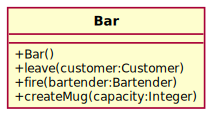
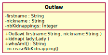

TD n°1
======

Exercice 1
----------




Pour chacune de ces deux classes, modifiez le diagramme pour en faire un Singleton.


Exercice 2
----------

Un client fait appel à nous pour développer un jeu vidéo de courses automobiles. Un joueur doit pouvoir conduire plusieurs sortes de voitures, avec dans un premier temps une Subaru, une Jeep et une Fiat Multipla. Toutes les voitures font le plein de la même manière mais chacune accélère différemment (perdant ainsi plus ou moins de carburant) et klaxonne de façon unique.

1. Proposez une hiérarchie de classes avec attributs et méthodes pour représenter les voitures.
2. Implémentez ces classes en Java.
3. Créez un programme (à faire apparaitre sur le diagramme) qui s'exécute en ligne de commande comme ceci :
```bash
$ java CarGame
Subarau créée.
Plein de la Subaru effectué.
Klaxon : Turlututu !
Accélération : ZRRRRRRROUMMMMMMMMMM !
Jeep créée
Plein de la Jeep effectué.
Klaxon : Buuuuuup Buuuuuup !
Accélération : Jiiiiiiiiionnnnnn !
...
```
4. Quel design pattern vous semblerait adapté pour construire ces voitures avec moins de dépendances ?
5. Complétez et/ou modifiez votre diagramme de classe pour utiliser ce design pattern afin de permettre de créer des voitures sans connaître leur type concret.
6. Créez un second programme qui s'exécute en ligne de commande comme ceci :
```bash
$ java CarGame Subaru
Plein de la Subaru effectué.
Klaxon : Turlututu !
Accélération : VRRRRRRROUMMMMMMMMMM !
```
7. Transformez votre système de construction des voitures en un Singleton.

Exercice 3
----------

### Justin feu

On souhaite modéliser un feu de circulation de la façon suivante :

- un état indiquant si le feu est allumé ou éteint,
- une couleur verte, orange ou rouge.

Un feu doit avoir deux fonctionnalités, la première permettant de changer son statut allumé/éteint et la seconde permettant de passer à al couleur suivante.


1. Proposez un diagramme de classes modélisant un tel feu.
1. Implémentez ce feu en java.
1. Écrivez un programme qui crée un feu, l'allume puis change 5 fois sa couleur, en affichant l'état complet du feu (
   on/off + couleur) après chaque modification du feu.

### Un feu - deux ~~bois~~ modes

On souhaite maintenant pouvoir modifier **à la demande** le mode de fonctionnement du feu, c'est à dire pouvoir choisir :

- soit un feu français avec l'alternance vert, orange, rouge, vert,
- soit un feu allemand avec l'alternance vert, orange, rouge, orange, vert.

La modification du mode de fonctionnement peut avoir lieu à n'importe quel moment, l'alternance des couleurs s'adapte immédiatement.

4. Quel design pattern permettrait de répondre à cette demande de façon efficace ?
4. Proposez une seconde version du diagramme de classes utilisant ce design pattern pour permettre la modification du mode de fonctionnement.
4. Adaptez votre code Java à cette nouvelle modélisation.
4. Ajoutez des instructions à votre programme principal pour qu'il :
	- modifie son mode de fonctionnement,
	- changez 5 fois sa couleur.
