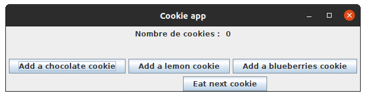
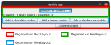

Cookies géants
==============

Consignes générales
-------------------

**Tous les documents sont autorisés (cours, TDs, TPs, internet) mais il est strictement interdit de communiquer de quelque façon que ce soit avec qui que ce soit.**

Tout ce que vous produirez devra respecter au maximum les principes de conceptions et mettre en œuvre les bonnes pratiques de programmation qui ont été vus en cours, TD et TP. 

Sujet
-----

### 1. Les recettes

Vous souhaitez vous lancer dans la confection de cookies géants de 3 sortes. La recette de base qui permet de fabriquer **UN** cookie est identique pour les 3 sortes, exceptés les points suivants :

- Pour les **cookies aux pépites de chocolat** :
  - le beurre est ramolli au micro-onde
  - le sucre est mélangé avec un fouet
  - il n'y a pas de sucre vanillé
  - il cuit 10 minutes
- Pour les **cookies au citron** :
  - le beurre est ramolli au bain-marie
  - le sucre est mélangé avec une spatule
  - il y a du sucre vanillé
  - il cuit 11 minutes
- Pour les **cookies aux myrtilles** :
  - le beurre est ramolli à la casserole
  - le sucre est mélangé avec une cuillère en bois
  - il y a du sucre vanillé
  - il cuit 8 minutes

1. Réalisez un diagramme de classe `cookiesV1.puml` puis une implémentation dans un package `v1` qui utilisent le **patron de conception Template** et permettent, à partir de ce `main` :

```java
public static void main( String[] args ) {
	new CookieChocolate();
	new CookieLemon();
	new CookieBlueberries();
}
```
d'obtenir la sortie suivante :
```bash
$ java CookieAppV1
---------------------------------------------------
Préparation de votre cookie aux pépites de chocolat :
1. Beurre ramolli au micro-onde.
2. Sucre mélangé avec un fouet.
3. Œuf ajouté.
5. Levure ajoutée.
6. Farine ajoutée et remuée lentement : pâte obtenue lisse et homogène.
8. Petite boule formée avec la pâte à cookies sur la plaque de papier sulfurisé.
9. CookieAppV1.Cookie enfourné pour 10 minutes.
Votre cookie est prêt !
---------------------------------------------------
Préparation de votre cookie au citron :
1. Beurre ramolli au bain-marie.
2. Sucre mélangé avec une cuillère en bois.
3. Œuf ajouté.
4. Sucre vanillé ajouté.
5. Levure ajoutée.
6. Farine ajoutée et remuée lentement : pâte obtenue lisse et homogène.
7. Peau du citron rapée, zeste très fin obtenu et ajouté à la pâte.
8. Petite boule formée avec la pâte à cookies sur la plaque de papier sulfurisé.
9. CookieAppV1.Cookie enfourné pour 11 minutes.
Votre cookie est prêt !
---------------------------------------------------
Préparation de votre cookie aux myrtilles :
1. Beurre ramolli à la casserole.
2. Sucre mélangé avec une cuillère en bois.
3. Œuf ajouté.
4. Sucre vanillé ajouté.
5. Levure ajoutée.
6. Farine ajoutée et remuée lentement : pâte obtenue lisse et homogène.
7. Myrtilles ajoutées délicatement à la pâte.
8. Petite boule formée avec la pâte à cookies sur la plaque de papier sulfurisé.
9. CookieAppV1.Cookie enfourné pour 8 minutes.
Votre cookie est prêt !
```

### 2. Fabrication industrielle

Vos cookies font fureur et vous décidez rationaliser la confection des cookies avant de les distribuer.

2. Réalisez un diagramme de classe `cookiesV2.puml` basé sur le précédent et son implémentation dans un package `v2` qui utilisent le **patron de conception Factory** pour créer vos cookies.

3. Créez une classe `CookieAppV2` avec un `main` adapté à la fabrique. L'exécution doit produire une sortie identique à celle de la 1ère version.

### 3. Des boites de cookies

*Fabriquer des cookies c'est bien, mais les manger c'est mieux.*

Les cookies que vous avez fabriqués ont 2 caractéristiques notables : le nombre de bouchées pour en venir à bout et le bruit caractéristique lorsqu'on le croque. Vous avez noté que :

- les cookies aux pépites de **chocolat** font "**Scrountch**" et se mangent en **2 bouchées** 
- les cookies au **citron** font "**Cratch**" et se mangent en **5 bouchées**
- les cookies aux **myrtilles** font "**Crosh**" et se mangent en **3 bouchées**

Afin de distribuer les cookies aux consommateurs, vous créez un paquet de cookies qui peut contenir :

- des cookies de plusieurs sortes
- un nombre quelconque de cookies

4. Réalisez un diagramme de classe `cookiesV3.puml` basé sur le précédent et son implémentation dans un package `v3` avec les contraintes suivantes :

   1. L'organisation des classes et les responsabilités qui leur sont attribuées doivent respecter le patron MVC au sein de 3 packages `v3.model`, `v3.view` et `v3.controller`.
   2. La vue doit permettre de gérer un paquet de cookies avec quatre boutons :
      - trois boutons pour créer/ajouter au paquet un cookie de chacune des trois sortes
      - un bouton pour manger le premier cookie de la boite.
   3. Le vue doit afficher en permanence le nombre de cookies qu'il reste dans le paquet.
   4. La vue doit afficher le bruit et le nombre de bouchées restantes à chaque fois qu'un cookie du paquet est croqué.
   5. Il faut utiliser le patron de conception **Observer**
   6. Le `main` doit instancier un paquet de cookie, un contrôleur et une vue et doit mettre en relation ces 3 entités.
   7. La vue doit être semblable à celle-ci :



*(Ce gif simule l'ajout d'un cookie au chocolat, puis l'ajout d'un cookie au citron puis la consommation de tous les cookies jusqu'à finir la boite.)*

et respecter cette disposition :



Rendu
-----

Le rendu se fait sur vôtre fork Gitlab de "A31", **dans un répertoire nommé "TPnote" à la racine de votre dépôt**.

- Les diagrammes de classe `cookiesV1.puml`, `cookiesV2.puml` et `cookiesV3.puml`
- les sources Java associées à ces 3 diagrammes dans des répertoires `v1`, `v2` et `v3`.
