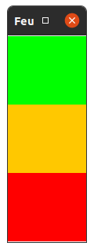
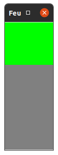
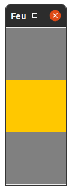
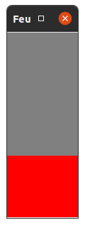
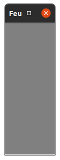
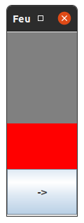

TD n°3
======

Exercice 1 : Feu tricolore graphique
------------------------------------

| Question 1 | Question 2 |
|------------|------------|
|  |     |

Les couleurs en version textuelle c'est bien, mais une vue graphique c'est mieux. Nous allons compléter notre code existant en créant une fenêtre qui simule un feu.

> Note :
> - Pour chaque question nécessitant de créer ou modifier une classe, commencez par mettre à jour votre diagramme de classe.
> - Votre diagramme doit être à jour avec votre code au début de chaque question.

#### Un feu statique

1. Créer une fenêtre graphique avec Swing composée de 3 `JLabel` en colonne avec respectivement une couleur d'arrière-plan verte, orange et rouge. 
   - Choisissez un "layout" adapté.
   - La méthode `setOpaque` de la classe `JLabel` vous sera utile.
   - Pour cette question, créez et affichez simplement une fenêtre dans votre classe qui contient le `main()`, en plus du code déjà présent.
2. Faites-en sorte que la fenêtre soit initialisée en fonction de l'état d'un feu : éteint, vert, orange ou rouge.

#### Un feu dynamique

3. Commencez par ajouter une temporisation après chaque changement d'état du feu à l'aide de l'instruction `Thread.sleep(1000);` et constatez que l'affichage du texte en console est progressif.
4. Transformez la fenêtre en un observateur d'un feu, tout comme l'est déjà la gestion de l'affichage :
   - Complétez la classe de la fenêtre.
   - Initialisez le processu d'observation du modèle par les vues dans la classe contenant le `main()`

#### Passage au MVC

5. Créez des packages `view`, `model` et `controller` et déplacez les classes existantes dans leurs packages respectifs. À vous de trouver le bon package de chaque classe.
6. Créer un contrôleur qui serve de Facade (le patron de conception) entre le main et le reste de l'application. Votre classe contenant le `main()` ne doit plus être responsable que :
   - de la création des modèles et vues
   - de la mise en place du processus d'observation du modèle par les vues
   - des appels au contrôleur pour l'enchaînement des états du feu.
   
En d'autres termes, la classe du `main()` ne doit plus dépendre que du feu, des deux vues et du contrôleur. À vous de décider quels attributs et quelles méthodes sont nécessaires dans la classe du contrôleur.

#### Gestion manuelle du feu

| Question 7 | Question 8 |
|------------|------------|
|  |  |

Commencez par supprimer toutes les actions effectuées par la classe du `main()` sur le feu : les questions suivantes vont progressivement ajouter la possibilité de modifier le feu grâce à des actions de l'utilisateur.  

> Note : **Toutes les questions qui suivent doivent respecter les principes du MVC.**

7. Ajouter un bouton en dessous du feu qui permette de passer à la couleur suivante du feu.
8. Ajouter un bouton qui permette d'éteindre/allumer le feu. Ce bouton doit se placer **à côté** du premier bouton.

#### Bonus

Pour les plus rapides, vous pouvez :

1. Désactiver le bouton qui passe à la couleur suivante lorsque le feu est éteint et le réactiver lorsqu'il est allumé. 
2. Transformer les 3 boutons de langue en boutons radios
3. Ajouter deux champs "input" pour sélectionner le nombre d'itérations à réaliser lorsqu'on clique sur le bouton de changement de couleur, ainsi que la durée de la temporisation.